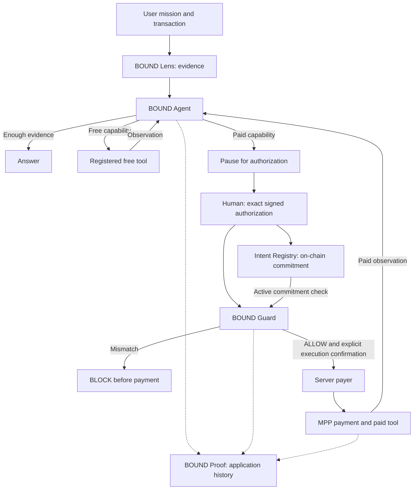

# BOUND

**The intent-integrity layer for autonomous AI agents that spend money.**

Primary track: **AI Agents**\
Secondary positioning: **Finance & Commerce**\
End-to-end prototype: **BNB Smart Chain Testnet · chainId 97**

Autonomy before the boundary. Deterministic authorization at the boundary. Autonomy resumes after the boundary.

## Problem

An agent can select a useful paid tool, but the request reaching payment may differ from what the human approved. Approving a recipient and amount alone does not establish that the payment still serves the same task.

## Solution

BOUND binds human authorization to a concrete paid-tool request and its payment boundary. Before the server payer can execute, BOUND Guard recomputes the actual request and checks it against signed authorization, a fresh payment challenge, and the on-chain intent commitment.

The prototype uses transaction analysis as its working example. BOUND Lens supplies deterministic evidence; the Agent decides whether that evidence is sufficient or another capability is needed.

## Why this is an AI Agent

BOUND Agent makes runtime decisions over available evidence and host-registered capabilities:

- Answer from existing evidence.
- Select and execute a free tool, observe its result, and reason again.
- Select a paid capability and pause for human authorization.
- Stop when no suitable capability is available.

After successful paid execution, the API converts the provider result into an observation and re-enters the Agent runtime with the original goal.

The runtime is bounded to four planning steps per invocation. The model cannot register tools, change their access class, or authorize payment.

Displayed activity consists of observable decisions, tool actions, observations, and execution states—not hidden chain-of-thought.

## Components

| Component | Responsibility |
|---|---|
| **BOUND Lens** | Deterministic transaction evidence: the PERCEIVE layer. |
| **BOUND Agent** | Reasoning, planning, tool selection, observation, and re-planning. |
| **BOUND Guard** | Deterministic authorization checks before protected paid execution. |
| **BOUND Intent Registry** | On-chain commitment of the exact request hash and payment boundary. |
| **BOUND Proof** | Durable application activity with authorization, decision, anchor, and payment metadata. |

Lens retains broader EVM support internally. The end-to-end guarded paid Agent prototype is scoped to **BNB Smart Chain Testnet**.

## Architecture



The registry stores authorization commitments. The server payer executes payments. These are separate responsibilities.

## Runtime paths

| Path | Behavior |
|---|---|
| Existing evidence | PERCEIVE → REASON → ANSWER |
| Free capability | REASON → PLAN → ACT → OBSERVE → REASON; answer or plan again |
| Paid capability | REASON → PLAN → PAUSE → human authorization → registry commitment → Guard |
| Authorized execution | Guard passes → explicit execution confirmation → payment/tool execution → paid observation → Agent runtime resumes |
| Missing capability | Stop and report the remaining evidence gap |
| Request drift | Guard blocks the protected paid path |

Not every run visits every stage. `PERCEIVE`, `RE-PLAN`, and `ANSWER` describe the product lifecycle. Recorded runtime phases are `REASON`, `PLAN`, `ACT`, `OBSERVE`, `PAUSE`, and `STOP`.

## Guard and the spending boundary

The human signs an EIP-712 authorization containing:

- Authorization ID and exact request hash.
- Tool ID and method.
- Chain ID, payment token, recipient, and maximum amount.
- Credential type and expiry.

The request hash binds the concrete tool request and its arguments. The browser wallet also submits the intent commitment to the registry.

Before protected execution, the API checks the active on-chain commitment. Guard then compares the actual request and fresh MPP payment challenge with the signed authorization, including signer validity, expiry, request identity, chain, token, recipient, amount ceiling, and credential type.

**ALLOW** means authorization checks passed. It does not mean payment occurred: verification can return `READY` without invoking the payer.

**BLOCK** means the protected flow stops before payment signing and broadcast. Expired authorization requires reauthorization.

Payment additionally requires explicit execution confirmation and server-side enablement. The server payer transfers TEST_USDT, obtains an MPP hash credential, and submits that credential to the protected provider.

### Security scope

- Human authorization and the server payer are separate. The browser wallet signs authorization and anchoring; the server wallet signs payment.
- Enforcement depends on the protected server execution path.
- The registry neither holds funds nor transfers tokens. It does not atomically execute or consume a payment authorization.
- A caller cannot reuse an existing registry intent ID, even after revocation.
- Proof is durable application history, not an immutable on-chain record of the entire Agent run.
- Request integrity does not establish tool honesty, RPC honesty, transaction safety, or AI correctness.
- BOUND does not claim universal replay prevention or comprehensive prompt-injection protection.

## BSC Testnet deployment and proof

| Evidence | Reference |
|---|---|
| Network | BNB Smart Chain Testnet, chainId `97` |
| Intent Registry | [`0xc85EdD8C5084195c4781dEE49611989127cAdB6b`](https://testnet.bscscan.com/address/0xc85EdD8C5084195c4781dEE49611989127cAdB6b) |
| Registry deployment | [Deployment transaction](https://testnet.bscscan.com/tx/0x224a34f3765d29a3f79bb509660a563aa2e91f7b25fffb421dac74367c41375f) |
| Analyzed subject | [Subject transaction](https://testnet.bscscan.com/tx/0xc26914982ccea9c13aee846880a904136f145f8699661c9d1f0db96138aef825) |
| Matching intent anchor | [Anchor transaction](https://testnet.bscscan.com/tx/0xb1a8cd53a7dce07f0527c3f782b5b651558c0a3f52f79746ba2e42276980a66a) |
| Canonical payment | [Successful 0.001 TEST_USDT payment](https://testnet.bscscan.com/tx/0xdfdd06240925f028342c16f99c1d23c5072c0ce1cd5c0499e846f658f320ecc1) |
| Deployment metadata | [`deployments/bsc-testnet/BOUNDIntentRegistry.json`](deployments/bsc-testnet/BOUNDIntentRegistry.json) |

The canonical payment succeeded on October 5, 2026 at 13:50:18 UTC, block `135025016`. Its matching anchor is in block `135024994`.

Matching application records identify:

```text
Authorization ID:
217dc6cf-b4c7-4235-bae9-4e8d3a630d58

Intent ID:
0xc75bcfef271e1cf3815632b7b374ef3d39a999e9387a9343937c9dd1726c467b

Authorized and actual request hash:
0x6b75fd0b380924e22b3936fb8c5ca44db19f92aef06beed3ead6a3d47afca628
```

The durable sequence records `PAUSED_FOR_AUTHORIZATION`, `CONFIRMED`, `ANCHORED`, `READY`, and paid execution `COMPLETED`. The final execution event records `payerInvoked=true` and `paymentBroadcast=true`.

**Evidence limit:** the selected run’s original provider response, paid observation, resumed Agent activity, and final answer were not recovered. `COMPLETED` establishes paid execution completion; it does not independently establish successful Agent continuation. Current source implements continuation, but the exact historical output cannot be reconstructed from these records.

The dashboard also contains an older payment reference, `0x4185…7450`, from October 3. It is a separate run; the authorization and anchor above must not be attributed to it.

The analyzed subject transaction is evidence input. BOUND does not recreate or replay it.

## Run locally

Use the full repository checkout. Node `v26.10.0` and npm `11.19.1` were observed in the verified environment; these are not established minimum versions.

Install dependencies:

```bash
npm ci
npm --prefix dashboard ci
```

### Lens and free Agent

Start the current Workspace API with payments disabled:

```bash
BOUND_ALLOW_REAL_PAYMENT=NO npm run product-api
```

In another terminal:

```bash
npm --prefix dashboard run dev
```

Open the URL printed by Vite, normally `http://localhost:5173/app`.

Lens inspection needs reachable chain RPC services. Agent reasoning additionally needs `GEMINI_API_KEY` and model connectivity. Registered free tools may depend on external evidence services.

The Product API loads the root `.env` through its imported transaction-agent module. Keep `BOUND_ALLOW_REAL_PAYMENT` unset or set to `NO` there as well. Never commit credentials.

### Provider, only when needed

To obtain paid-provider challenges, supply `MPP_SECRET_KEY` and `BOUND_MPP_RECIPIENT` to the provider process, then run:

```bash
npm run mpp-tool
```

The provider does not have the API’s equivalent `.env` loader. Its environment must be supplied separately. Merchant configuration must agree between the provider and Product API.

Starting the provider does not authorize or execute a payment.

| Configuration | Purpose |
|---|---|
| `GEMINI_API_KEY` | Required for Agent reasoning/planning |
| `GEMINI_MODEL` | Optional model override |
| `BOUND_BSC_TESTNET_RPC` | Optional testnet RPC override |
| `BOUND_API_HOST`, `BOUND_API_PORT` | API binding; defaults to `127.0.0.1:8791` |
| `BOUND_MPP_TOOL_URL` | Provider URL; defaults to `http://127.0.0.1:8788` |
| `BOUND_MPP_TOOL_PORT` | Provider port; defaults to `8788` |
| `VITE_BOUND_API_URL` | Frontend API URL override |
| `BOUND_ALLOWED_ORIGINS` | API origin configuration |
| `BOUND_ACTIVITY_HISTORY_PATH` | History path override; default `.bound/activity/events.jsonl` |
| `BOUND_AGENT_PRIVATE_KEY_PATH` | Server payer key-file path |
| `BOUND_ALLOW_REAL_PAYMENT` | Payments enabled only by the explicit value `YES` |

A full paid run additionally needs a funded testnet payer, a human wallet with anchoring gas, the deployed registry, exact authorization, and explicit execution confirmation. It is not required for the read-only proof walkthrough.

### Validation

```bash
npm --prefix dashboard run build
npm run typecheck
npm test
git diff --check
```

At product checkpoint `1ca8122`, the project reported a passing dashboard build, typecheck, 151 tests, and a clean diff check.

## Demo paths

- `/app`: inspect evidence and run the Agent.
- `/docs`: product manual and API overview.
- `/proof`: durable activity available in the running installation.

A fresh checkout does not contain the original local history. Starting the application will not recreate historical proof records or historical Agent answers.

## Limitations

- One guarded paid capability: transaction analysis on BSC Testnet.
- Bounded tool registry and runtime; unsupported requests may remain unanswered.
- External RPC, model, and provider availability affect execution.
- Payment completion does not guarantee successful provider delivery or Agent continuation.
- Full provider responses and final Agent outputs are not persisted in activity history.
- Plans and authorization records use expiring in-memory state.
- The prototype is not a wallet product, trading system, scam detector, or production-ready multi-chain payment platform.

## Future work — not implemented

- Persist complete execution outputs and continuation outcomes for review.
- Strengthen durable execution recovery and payment reconciliation.
- Independently review the authorization boundary before broader deployment.

The original design specification remains available in [`SPEC.md`](SPEC.md).
